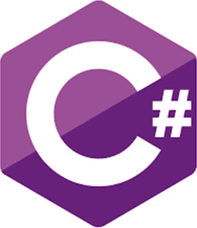

# * &nbsp; Hello World &nbsp; *

  

  

    

  

 

<table align="center">
  <tr>
   <td colspan="9" align="center">
        💼 My Tools
    </td>
  </tr>
  <tr>
    <td align="center" width="96">
      
       Bash
    </td>
      <td align="center" width="96">     
            
       Django
    </td>
    <td align="center" width="96">    
           
       Docker
    </td>
    <td align="center" width="96">   
          
       Eclipse
    </td>
    <td align="center" width="96">   
         
       Laragon
    </td> 
    <td align="center" width="96">   
         
       Wamp
    </td> 
  </tr>

  <tr>
    <td align="center" width="96">     
          
       MySQL
    </td>
    <td align="center" width="96">    
         
       NodeJs
    </td>
    <td align="center" width="96">
        
       Code
    </td>
    <td align="center" width="96"> 
       
       Xcode
    </td>
  </tr>

</table>

 

<table align="center">
  <tr>
   <td colspan="9" align="center"> 
        🏵️ Programming Languages 
    </td>
  </tr>
  <tr>
    <td align="center" width="96"> 
      
       C#
    </td>
    <td align="center" width="96">
      
       C++
    </td>
    <td align="center" width="96">
      
       Java
    </td>
    <td align="center" width="96">
      
       Python
    </td>
  </tr>
</table>

 

<table align="center">
   <tr>
   <td colspan="5" align="center">
        🌹 Skill Web Programming
    </td>
    <td colspan="4" align="center">
        🌻 Framework
    </td>
  </tr>
  <tr>
    <td align="center" width="96">
      
       HTML
    </td>
    <td align="center" width="96">
      
       CSS
    </td>
    <td align="center" width="96">
      
       SQL
    </td>
    <td align="center" width="96">
      
       PHP
    </td> 
    <td align="center" width="96"> 
      
       JavaScript
    </td>
    <td align="center" width="96">
      
       Bootstrap
    </td>
    <td align="center" width="96">
      
       Tailwind 
    </td>
    <td align="center" width="96">
      
       React
    </td> 
    <td align="center" width="96">
      
       Vue
    </td>
  </tr>
</table>

 

<table align="center">
  <tr>
    <td colspan="9" align="center"> 
        📖 Machine Learning Libraries
    </td>
  </tr>
  <tr>
    <td align="center" width="96"> 
      
       Keras
    </td>
    <td align="center" width="96">  
        
       PyTorch
    </td>
    <td align="center" width="96">
        
       TensorFlow
    </td>
  </tr>
</table>

 

<table align="center">
  <tr>
  <td colspan="5" align="center"> 
        🗃️ Data Warehouse
    </td>
  </tr>
  <tr>
    <td align="center" width="96">  
        
       MongoDB
    </td>
    <td align="center" width="96">
      
       Tableau
    </td>
    <td align="center" width="96">
      
       APEX
    </td>
  </tr>
</table>

 

  
 <strong>My Stat Detail</strong> 

   

  

  

<a> 
    
  
   
</a>

###

<h3 align="left">
    👋 Connect With Me
</h3>

  
  
  
  
  

  
  
  
  
  

 

 
<b>Visitors Count 👽 </b>
  

 
 

